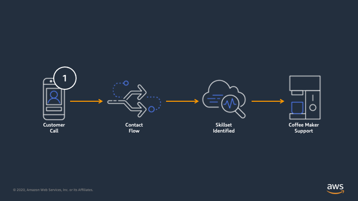
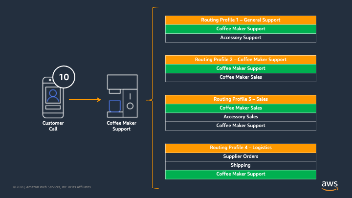
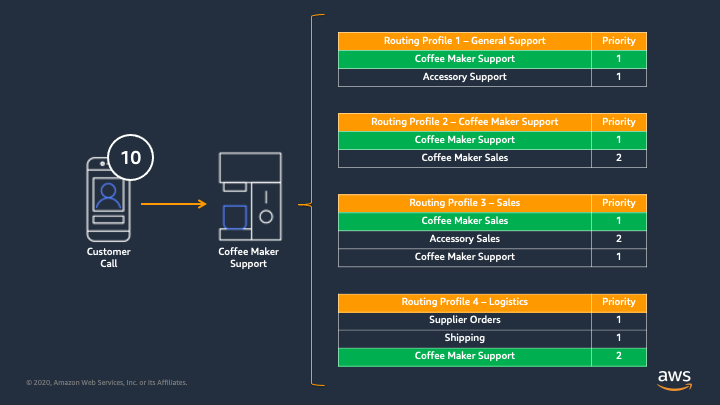
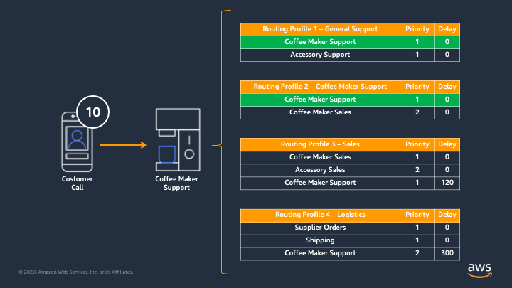
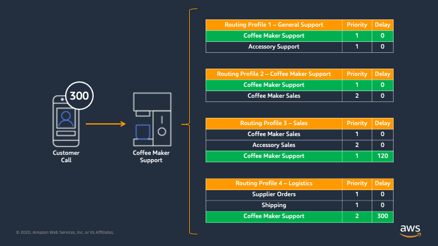
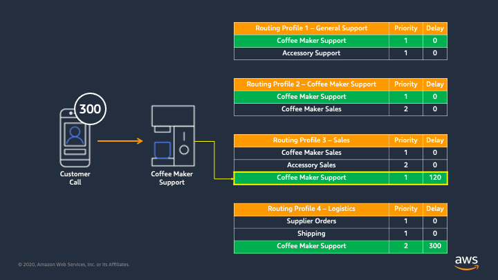

# Managing increases in call volumes with routing profiles
All contact centers need to deal with fluctuations in call volumes. Depending on the overall customer strategy, any number of measures can be put into place to reduce call spikes or to deflect them using various methods. Depending on configuration or scenario, some of the more common deflection methods include:
* **Providing access to an FAQ:** Either via voice menu or redirecting to a website, adding the option to find answers to frequently asked questions can reduce the overall call volume that reaches your agents. Deflection to a web-based FAQ is tyrpically preferred as it will reduce the load on the telephony infrastructure. 
* **Providing robust self-service options:** Finding ways for customers to self serve allows for reduction in call volume that reaches queues while also providing for good customer experiences. 
* **Offer callbacks:** Providing the customer with the option to be called back when it is their turn is great for customer experience, but it doesn't necessarily reduce the queue load since the calls are still technically in the queue. It does also offer cost savings in Amazon Connect/Service Cloud Voice as telephony charges and platform minutes are not consumed while a callback is queueud.
* **Provide estimated wait times:** As ealry as possible in the customer experience, make sure to let them know how long they may be waiting. In some cases, customers will just decide to call back later, in others it may influence their decision to select a callback or leave a voicemail. It can also just reinforce their decision to remain in queue. Whatever impact it has, you're providing the customer with the information they need to make a decision that is best for them, improving the customer experience. 

These examples all work to reduce the overall queue volume, or to improve the customer experience, but they're still not dolving the immediate problem when a larger than expected number of calls actually make it to queue. If, despite all of these efforts, customers still need to talk to agents, you need a way to make sure you have enough people to handle the volume. And since we're specifically talking about unexpected spikes in volume, we're looking at bringing agents into the mix that we didn't necessariy plan on having take these calls. In legacy contact centers, there were a few approaches:
* **Move agents into the queue:** One of the most basic steps that can be taken is to add agents that may not be perfectly skilled into the queue to help on a short term basis. This is a typical reactionary measure. The problems with this action are:
  * It requires manual intervention by supervisors/administrators
  * It often requires manual action by the agents 
  * It can remove agents from their primary responisbilities or impact their typical queue performance
  * It requires manual action to revert
* **Move the calls to another (overflow) queue:** In some cases or configurations, an overflow queue may be configured that has a larger pool of agents assigned to it. When calls in queue reach a certain threshold, they are diverted to the overflow queue. While this does expand the pool of agents, it also introduces other issues that would need to be address, such as:
  * Reporting data is now mixed up because calls will have been in different queues. In some cases, if there is one generalized overflow queue, it can be difficult to understand where they originated. This impacts long term queue statistics and can even make it harder to get a clear picture of what happened for future planning
  * By moving the call, you are resetting its queue time.  Queue time is based off of the time that the call was placed into the specific queue it is currently in, by moving that call to a different queue, you are potentially changing its priority and impacting the overall wait time. 

In Service Cloud Voice and Amazon Connect, the best way to deal with these spikes is by using [routing profiles](https://docs.aws.amazon.com/connect/latest/adminguide/concepts-routing.html). Routing profiles provide the ability to establish queues that a certain group of agents can take calls for, the prioritization of those queues for that batch of agents, and the amount of time a call needs to be in queue before that group is even eligible to take that call. This allows you to configure groups of agents to take calls for queues that they would not typically handle when they meet certain criteria. This is preferable over the manual methods because:
* **It is dynamic.** Once these configurations are made, Connect will simply evaluate calls and available pools of agents based on the available metrics at the time of the call's arrival. It then continues to re-evaluate based on queue metrics as the call sits in queue and as agents move between states. There is no manual interaction that needs to take place.
* **No action is required by the staff.** When calls meet the queue criteria in the routing profile, any available agents with that profile ecome eligible to handle the call. 
* **The calls never leave the queue.** This is important from a reporting and prioritization standpoint. Since the calls are not moved or requeued, the reporting data maintains its integrity and the prioritization is not reset.
* **You have more control, with less direct monitoring.** By configuring routing profiles, you can make the prioritization decisions that make sense for your business and let Connect enforce them, instead of relying on constant monitoring and manipulation of queues. 

### An Example
Let's let at a sample scenario to better understand how this would work. In this example, let's image that we are a company that produces coffee makers for the retail market. We run a contact center that takes calls for coffee maker sales, coffee maker support, accessory sales, accessory support, supplier orders, and shipping information. We have four core groups in our contact center: General Support, Coffee Maker support, Sales, and Logistics. 

Based on this, we have configured the following queues:
* Coffee Maker Support
* Accessory Support
* Coffee Maker Sales
* Accessory Sales
* Supplier Orders
* Shipping

And we've built the following routing profiles:
* General Support
* Coffee Maker Support
* Sales
* Logistics

Now, lets consider what happens as calls come in. 

1. A customer calls into the contact center. They need help with their coffee maker.

2. A contact flow is invoked that provides the customer experience, handles back-end data acquisition, executes any custom integrations, etc.

3. Based on options selected, data lookups, and whatever other mechanism are put into place, a skillset for this call is identified. 

4. In this case, they need support for their coffee maker, so the Coffee Maker Support queue is most appropriate, and Connect places the call into that queue.

 
5. Once the call is in queue, Connect will try to find an agent to take this call. It does this by evaluating the routing profiles. 

 
6. Connect will look across all routing profiles to see which ones have the Coffee Maker Support queue in them. Since our business is all about coffee makers, and we want to make sure our customers' calls are answered, we have added the Coffee Maker Support queue to each of the routing profiles. So, at this point in the evaluation, all available agents are eligible to take this call.

7. Using priorities allows us to specify how important the queues are, relative to one another, in a given routing profile. From this example, we can see that Coffee Maker Support is the number 1 priority for the Coffee Maker Support routing profile, and rightfully so. You’ll also notice that its NOT the highest priority for the Logistics routing profile. So we’ve determined that all agents should be prepared to take Coffee Maker Support calls, but its probably not the best use of the Logistics team’s time. In their case, Supplier Orders and Shipping calls take priority. If there are no calls in those queues, then they can take a Coffee Maker support call.

8. But we also have the concept of a delay. Delays allow us to only make certain routing profiles eligible to take a call if the call has been in that queue longer than the delay time. This is how we really cover these call volume spikes. If we look at the Sales and Logistics routing profiles, you see that they have a delay for the Coffee Maker Support queue of 120 and 300 seconds respectively. This means that until a call has been in queue longer than the delay, those routing profiles (and the agents assigned to them) are not eligible for this call. And we see that here as those routing profiles are removed from the pool of eligible agents.

9. But as we reach 120 seconds in queue, the Sales routing profile becomes eligible. 

10. And further on, when we hit 300 seconds, the logistics team becomes eligible, as long as there are no Supplier Order or Shipping calls.

11. And in this example, an agent on the Sales team finally becomes available, and the call is routed to them. What’s critical to remember is that we never:
 - Moved the call to a different queue
 - Moved agents to different routing profiles
 - Added queues to different routing profiles
 - Changed the priority of the call

In this example, by simply configuring the routing profiles to match our business needs, we expanded the pool of agents that could handle this call in its original queue by increasing the routing profiles that could be considered for routing, thereby increasing the pool of agents. 
