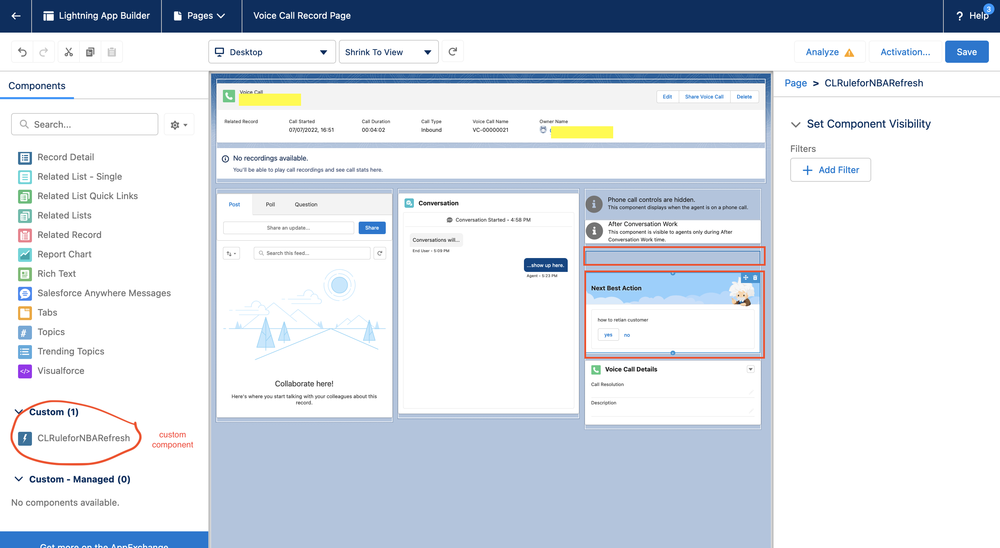

### Salesforce Configuration

This section covers configurations on Salesforce side. As we have seen in the previous section, AWS configurations enable updating custom field in Voice Call object whenever Contact Lens real-time rule is matched. Post this, series of actions will be executed in Salesforce to trigger Next Best Action strategy and surface relevant Recommendation on agent screen.

**Important Notes**:

1. The code for this example is for non-production use only
2. For Salesforce APIs and Platform Events' volume considerations and limitations, please contact Salesforce

### Salesforce Package

In order to enable Contact Lens driven Next Best Action following Salesforce components need to be installed in your Salesforce org:

1. Current_Call_Category - This is a custom field in Voice Call object which will be updated based on Amazon Connect Contact Lens real-time rule match
2. Generate CL Platform Event - This is a Process Automation flow which will be triggered whenever Current_Call_Category field changes and generates Platform Event
3. clrtevent - This is a Platform Event which will be generated by Generate CL Platform Event flow
4. CLRuleforNBARefresh - This is Aura UI component which will trigger Next Best Action Strategy whenever there is a Platform Event clrtevent. This component needs to be added to Voice Call Record Page
5. CL_Rule_Driven_NBA_Strategy: This Next Best Action strategy which will be triggered and surfaces Recommendations on Voice Call Record Page (agent workspace) based on Contact Lens category name (value stored in Current_Call_Category)
6. test nba screen flow: This is a sample screen flow to associate with Salesforce Recommendations

To install above Salesforce components, you need to install Salesforce Package called - CLRTForNBA. This is un-managed package created only for learning or lab use (**Only for non-production use only**).

**Steps**

1. Click on this link - https://login.salesforce.com/packaging/installPackage.apexp?p0=04t8d000000DtH8&isdtp=p1
2. Enter your Salesforce credentials
3. For Package Password : SCVBootCamp123
4. Leave everything else as is and click on Install
5. Ensure that you will get success message in few minutes

### Salesforce Voice Call Record page

As we discussed, in the Agent Experience section, Voice Call Record page works as agent workspace.There are two UI components those needs to be added on Voice Call Record page.

**Steps**

1. From Setup, enter Lightning App Builder in the Quick Find box, then select **Lightning App Builder**
2. Click Edit for Voice Call Record Page, which will open Lightning App Builder
3. From the left panel, Components, drag **Einstein Next Best Action** component and drop it on right section of Voice Call Record Page
4. Select Einstein Next Best Action and configure as per following:

- Strategy Source : Strategy Builder
- Action Strategy : CL Rule Driven NBA Strategy (select from dropdown)

5. From the left panel, Components, scroll down till you find **CLRuleforNBARefresh** in Custom section and drag and drop **CLRuleforNBARefresh** on right section of Voice Call Record page
6. Save your work, then click **Activation**
7. Review the app default assignments, and then save your work. The record page is now available in the Lightning Service Console.

### Salesforce Recommendations

**Create Recommendations**

1. From Service Console App Launcher, enter **Recommendations**
2. Click on **New** upper right corner
3. Configure Recommendation as per following

- Name: welcome
- Description: SCV Bootcamp - _name of the Recommendation_
- Acceptance Label: Accept
- Rejection Label: Reject
- Action: test nba screen flow
  

4. Repeat step 3 to create recommendation, to be named sales, retain

**Next** - [Test use case](./deployment_test.md)
