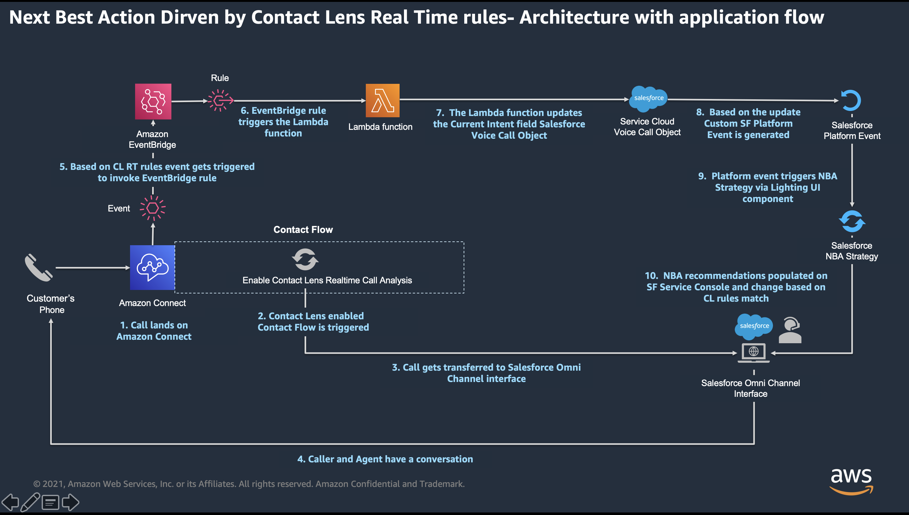

# Agent Assist - Amazon Connect Contact Lens driven Salesforce Next Best Action

Agent Assist capability helps agents to guide the conversation with the customer in the right direction to create enhanced customer experience. It also helps to achieve different business outcomes such as up/cross sell, retention, upgrade, Know Your Customer (KYC) etc. Such capability should be driven by the context of the conversation and dynamic to adapt changing context. Also, the recommendations or suggestions provided by such capability should be personalized for the customer.

In Service Cloud Voice (SCV) Amazon Connect Contact Lens along with Salesforce Next Best Action can enable Agent Assist capability. This Agent Assist can surface Salesforce Recommendations on agent screen based on contextual data provided Contact Lens real-time matched rules and category as well as customer data stored in Salesforce.

**Contextual data**: Contact Lens rules can be set based on one or more elements of the ongoing conversation between customer and the agent such as spoken phrases, sentiment, call queues, contact attributes etc.

**Customer data**: Salesforce Next Best Action Strategy can leveraged customer data stored in Salesforce CRM such as account, contact, order, cases etc. for personalization

## High level call flow

1. User sets up Contact Lens real-time rules to capture key events in real time during caller-agent conversation using Amazon Connect console
2. User enables Contact Lens real-time analysis within Contact Flow
3. Customer calls and converses with an agent
4. Based on conversation Contact Lens real-time rules are matched, EventBridge event and then lambda function are be triggered
5. This lambda function signals Salesforce to execute Next Best Action Strategy
6. The Next Best Action Strategy surfaces Recommendations according to the Contact Lens category

## High Level Architecture

Following high level architecture diagram shows the all the components involved as well as the flow.

1. Caller places a call on Amazon Connect phone number
2. Once the call lands on Amazon Connect, associated contact flow is triggered which has Contact Lens real-time call analysis enabled
3. Call gets transferred to Salesforce Omni-Channel agent interface, and agent answers the call
4. Conversation between the agent and the caller takes place
5. Based on the conversation Contact Lens real-time rule gets matched which triggers EventBridge event
6. Once EvertBridge receives and event, it triggers lambda function
7. This lambda function updates custom field in Voice Call object
8. This update will trigger custom Salesforce Platform Event, via Process Automation flow
9. Custom Salesforce Lightning component on agent screen (Voice Call Record page) listens to this Platform event and triggers Next Best Action (NBA) Strategy
10. NBA Strategy surfaces Recommendations based on Contact Lens rule and category
11. These sequence of events repeats after every Contact Lens real-time rule match, hence provides dynamic Recommendations based on changing context

## Example

In this example, we will demonstrate following Agent Assist capability for following business outcomes:

- Sells: When customer mentions to know about new product or asks for an upgrade, Recommendation for sales will be surfaces on agent screen
- Retention: When customer express displeasure with the quality of service or complains, Recommendation for retention will be surfaced on agent screen

To deploy this example please 

Notes: \* The code fpr this example is for non-production use only  
