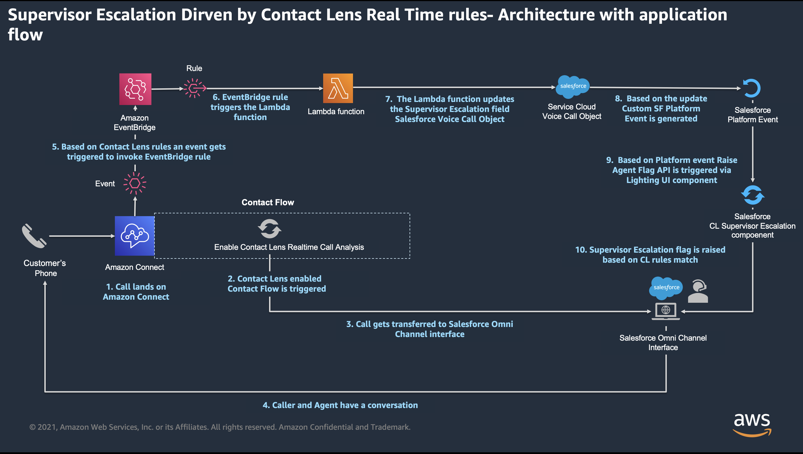

# Automated Supervisor Escalation using Amazon Connect Contact Lens Rules

**Service Cloud Voice Supervisor Escalation** Supervisor escalation is one of the key features to support agent with customer interaction when needed. Service Cloud Voice provides a capability for agent to manually raise a flag which indicates to the supervisor that support is needed. Then the supervisor can chat with the agent to provide required support.

More information - https://help.salesforce.com/s/articleView?id=release-notes.rn_voice_agent_flag.htm&type=5&release=238

**Supervisor Escalation using Amazon Connect Contact Lens** Contact Lens for Amazon Connect recognizes sentiment and categorizes customer conversations in real time to understand the voice of the customer. In this example, we are using Contact Lens to determine a scenario where agent needs assistance based on the ongoing conversation between agent and the caller, for example - if the customer sentiment is negative for 10 seconds and then automatically escalates to supervisor by rasing a flag.

## High level call flow

1. User sets up business rules for supervisor escalation using Amazon Connect console
2. User enables Contact Lens Realtime Call analysis\* within Contact Flow
3. Customer calls and converses with the agent
4. During the ongoing conversation, if customer's sentiment remains negative for more than 60 seconds then Contact Rule match event is generated
5. This event triggers the lambda function which in turn starts sequence of events in Salesforce
6. As a result, supervisor logged on to Service Cloud Voice Omni Supervisor Dashboard sees Supervisor Escalation flag raised
7. Supervisor starts monitoring the real time transcript of conversation between the agent and the caller, and can intervene as and when required by chatting with the agent

## High Level Architecture

Following high level architecture diagram shows the all the components involved as well as the flow.

1. Caller places a call on Amazon Connect phone number
2. Once the call lands on Amazon Connect, associated contact flow is triggered which has Contact Lens real-time call analysis enabled
3. Call gets transferred to Salesforce Omni-Channel agent interface, and agent answers the call
4. Conversation between the agent and the caller takes place
5. Based on the conversation Contact Lens real-time rule gets matched which triggers EventBridge event
6. Once EvertBridge receives an event, it triggers the lambda function
7. This lambda function updates custom field in Voice Call object
8. This update will trigger custom Salesforce Platform Event, via Process Automation flow
9. Custom Salesforce Lightning component on agent screen (Voice Call Record page) listens to this Platform event and triggers an API to raise supervisor escalation flag
10. Supervisor on Omni Supervisor Dashboard sees the flag and start monitoring (viewing) conversation between agent and the customer
11. Supervisor can initiate internal chat with the agent which will be stored as part of call transcript

## Example

In this example, we will demonstrate escalating to supervisor by rasing a flag if customer sentiment remains negative for 10 seconds.

To deploy this example please [click here](Docs/deployment_aws.md)
