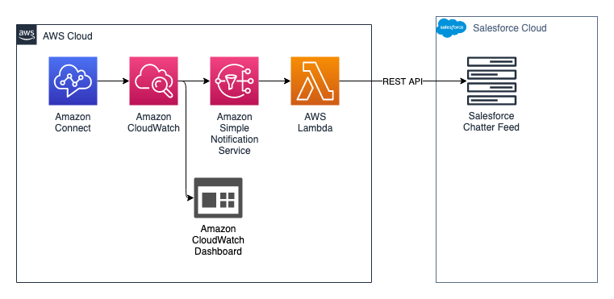

# AWSSCV Dashboard Alarms

AWSSCV Dashboard Alarms provides a set of Cloudwatch alarms allowing administrators to receive notifications of alarms for various Amazon Connect metrics.

To deploy Voicemail express, you will need to complete the following:
1. Complete the [AWSSCV Common Layers](../../Common/AWSSCV-CommonLayers/readme.md) Setup
2. Complete the [AWSSCV Salesforce Config](../../Common/AWSSCV-SalesforceConfig/readme.md) setup
3. Complete the [Dashboard Alarms Prerequisites](Docs/dashboard_alarms_prerequisites.md)
4. Complete the [Dashboard Alarms Installation](Docs/dashboard_alarms_installation_instructions.md)