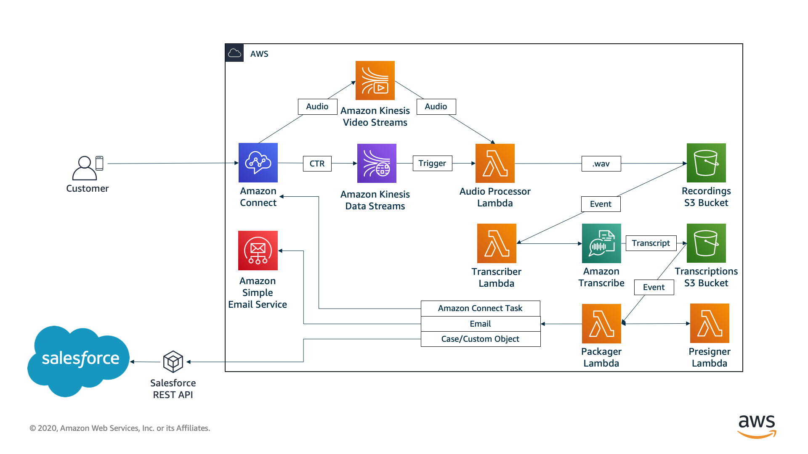

| :warning: IMPORTANT          |
|:---------------------------|
| Voicemail Express is an AWS-developed solution that provided a voicemail option for Service Cloud Voice customers who needed voicemail. With the [Winter '23 release](https://help.salesforce.com/s/articleView?id=release-notes.rn_voice_route_play_back_voicemails.htm&type=5&release=240), due to be deployed to all pods in October, Salesforce has implemented a variant of this solution natively. While this version still works, customers should use the [supported version from Salesforce](https://help.salesforce.com/s/articleView?id=release-notes.rn_voice_route_play_back_voicemails.htm&type=5&release=240). This solution will be archived by end of the year. Newer versions of this solution will not support Service Cloud Voice, and will focus on delivery of voicemails as Amazon Connect Tasks or as Emails.|

# Voicemail Express V2
Voicemail Express is designed to provide basic voicemail functionality to Amazon Connect Customers. It has been designed to work in a variety of customer deployment models, including Service Cloud Voice. Voicemail express provides delivery of voicemail via a variety of mechanism and also offers customization patterns for other delivery models. This version natively supports voicemail delivery via Amazon Connect Task, e-mail delivery via Amazon Simple Email Service, Salesforce Case, Salesforce custom objects, or a custom delivery mode of your own design. It has also been redesigned to support different modes on a call-by-call basis.

## What's new
-  Now supports multiple delivery models, including Amazon Connect Tasks, email delivery via Amazon Simple Email Service, Custom Salesforce Objects, as well as a plugin option for anything else you wish to use.
-  Supports multiple installations in one account for different Connect instances
-  Supports upgrades, rollbacks, and specific version installations
-  Once prerequisites have been completed, the solution installs completely and is immediately useable without extensive configuration. From template launch to Voicemail delivery via Amazon Connect Task can be completed in less than 10 minutes.
-  Improved documentation
-  Improved deployment experience

With Voicemail Express, customers can have the option to leave a voicemail for an agent or queue. Once the voicemail is recorded, a series of processes take place that ultimately result in:
1. Voicemail stored in S3 as a .wav file
2. Transcription of the voicemail
3. Presigned URL that provides access to the voicemail from Salesforce without the need for authentication into AWS.
4. Voicemail is packaged for delivery, including the transcription, presigned URL, and contact data. It is then delivered via the chosen mechanism.

Voicemails in this solution are configured for a lifecycle of up to 7 days. After 7 days, the recordings are lifecycled and the presigned URL is no longer valid. During deployment, you have the option to reduce this lifecycle window, if desired. Additionally, you have the option to keep, archive, or delete voicemail recordings. However recordings are lifecycled, the data (with transcript) will reside in the selected delivery system.

To deploy Voicemail Express, you will need to complete the following:
1. For customers that are deploying Salesforce delivery modes, complete the [AWSSCV Salesforce Config](../../Common/AWSSCV-SalesforceConfig/readme.md) setup
2. Complete the [Voicemail Express Prerequisites](Docs/vmx_prerequistes.md)
3. Complete the [Voicemail Express Installation](Docs/vmx_installation_instructions.md)

Once Voicemail Express has been deployed, you can learn more about the different modes by referencing the following documents:
1. [High-level overview of the Voicemail Express solution](Docs/vmx_core.md)
2. [Delivering Voicemails as Amazon Connect Tasks](Docs/vmx_tasks.md)
3. [Delivering Voicemails via Amazon Simple Email Service](Docs/vmx_email.md)
4. [Delivering Voicemails as Salesforce Cases](Docs/vmx_sfcase.md)
5. [Delivering Voicemails as Salesforce Custom Objects](Docs/vmx_sfcustom.md)
6. [Creating your own custom delivery mode for Voicemails](Docs/vmx_custom.md)

Finally, some basic troubleshooting steps can be found on the [Troubleshooting Common Voicemail Issues](Docs/vmx_troubleshooting.md) page.

**Current Published Version:** 2022.08.01
Current published version is the version of the code and templates that has been deployed to our S3 buckets
